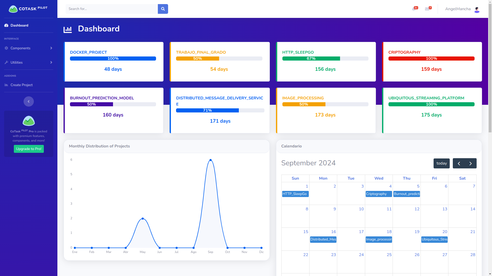

# CoTaskPILOT

## Description

This is a software project management solution that provides users with a powerful tool to **manage projects and teams** in the most efficient and updated way. This app tackles the user’s necessities, aligns with the incoming technologies, and is able to take advantage of the artificial intelligence features in order to guarantee efficient and organized project and team management. Additionally, the project aims to achieve the following key objectives:

- Develop a **machine learning model** capable of predicting the criticality of the projects that the user has pending.
- Implement an **integrated chat** that is available among the contributors of the same project.
- Extract statistics from the set of projects that can be viewed by the user to have a **global perspective** of their status.
- Integrate itself with **third-party environments like GitHub**.


## Table of Contents

- [Installation](#installation)
- [Tools](#Tools)
- [Usage](#usage)
- [License](#license)

## Installation

Although the application is also deployed in the cloud and accessible through the internet, instructions are also provided so that users are able to launch it from a local environment.

In this guide, the application will run with a _yaml_ file, except instead of running it on a production Kubernetes cluster with the AKS provided by Microsoft Azure, it will run on a local Kubernetes cluster like **Minikube**


1. Clone the repository to your local machine by accessing the following link:
   https://github.com/AngelMancha/summer_proyect_TFG.git

3. Execute the following lines of code in a Linux distribution to install Docker and Minikube:

```bash
sudo apt update && sudo apt install docker.io
sudo apt update && sudo apt upgrade
curl -Lo minikube https://storage.googleapis.com/minikube/releases/latest/minikube-linux-amd64
sudo install minikube /usr/local/bin
sudo apt install kubectl
```
3. Once installed, start the Minikube local cluster and verify the installation:
```bash
minikube start
minikube status
kubectl get nodes
```
4. Load the azure.yaml file:
```bash
kubectl apply -f azure.yaml
```
5. Finally, access the service that CoTaskPILOT will launch in the browser:
```bash
minikube service cliente-service
```

## Tools


The diagram depicts a distributed architecture based on microservices, where a server developed in C manages these microservices. The microservices are designed to handle two key aspects: the database, using MongoDB as the database management system, and the artificial intelligence model used by the application.

The C server is responsible for managing and accessing these microservices via the HTTP protocol. This approach limits direct client access to the microservices and reduces the exposure of the database to potential vulnerabilities and external attacks. Additionally, by adopting a microservices-based approach dedicated to specific functionalities, modularity and scalability are facilitated. A later section of this document discusses the advantages of using microservices in detail.

There is also a NodeJs server that acts as an intermediary between the front-end, developed with JavaScript, HTML, and CSS along with the Bootstrap framework, and the aforementioned C server. This NodeJs server manages simultaneous client connections to the application and establishes a connection with the C server to process and distribute information to the corresponding connected client. To communicate with the JavaScript front-end, this NodeJs server uses WebSockets, while TCP sockets are used for low-level communications with the C server. Additionally, it includes an HTTP server configured through Express to allow clients to connect from the internet.

The Docker tool is then used to containerize the application. Specifically, Docker is used to separately containerize the microservices, the C server, and the JavaScript front-end. Finally, to deploy the application in a real production environment, the Docker containers are orchestrated in a Kubernetes cluster deployed on Azure, Microsoft's cloud service provider, using AKS (Azure Kubernetes Service).
## Usage

Instructions on how to use CoTaskPILOT:


Once logged in, you initially have access to the general dashboard with all the projects available or pending at that moment by the user. In this interface you can obtain an overview of the status of each project, identified by each rectangular box.
Each project is accompanied by its percentage of completion and the number of days remaining for its delivery, since the order of the projects in the dashboard is given based on this last measurement.

In addition, there is also an interactive graph on the left side of the interface in which you can see the monthly distribution of projects over time, and just to the right there is an interactive calendar in which you can see the exact delivery day. of each project:



Continuing on the same main page, but scrolling a little further down you can find the artificial intelligence model section. In this part, by pressing the relevant button, an artificial intelligence model is applied which predicts the criticality of each project and assigns a value to each of them so that the user can decide which project to prioritize:


By clicking on any of the projects on the dashboard, the user is redirected to a new interface that serves as a control panel for the project on which they have clicked. In this new interface you can access a more detailed view of the project statistics, as well as members, tasks, status and even calendar detailing the delivery dates of each task.


Scrolling down the interface appears a section in which there is the possibility of linking the CoTaskPILOT project with an existing GitHub repository to view and interact with its content directly from the application.


Pressing on any of the contributing members of the same project opens a direct messaging chat.


Finally, a navigation map of all the interfaces is provided:


## License

This work is licensed under a Creative Commons Attribution-NonCommercial-NoDerivatives License


The Creative Commons Attribution-NonCommercial-NoDerivatives License (CC BY-NC-ND) is a restrictive license that allows others to distribute, copy, and display the work as long as they give credit to the author in the manner specified by the author. However, this license prohibits commercial use of the work and does not allow the creation of derivative works based on it.

When using this app or any part of it, please provide attribution to _**Ángel José Mancha Núñez**_ as the creator. Additionally, include a link to the original source code repository or website, if applicable.

